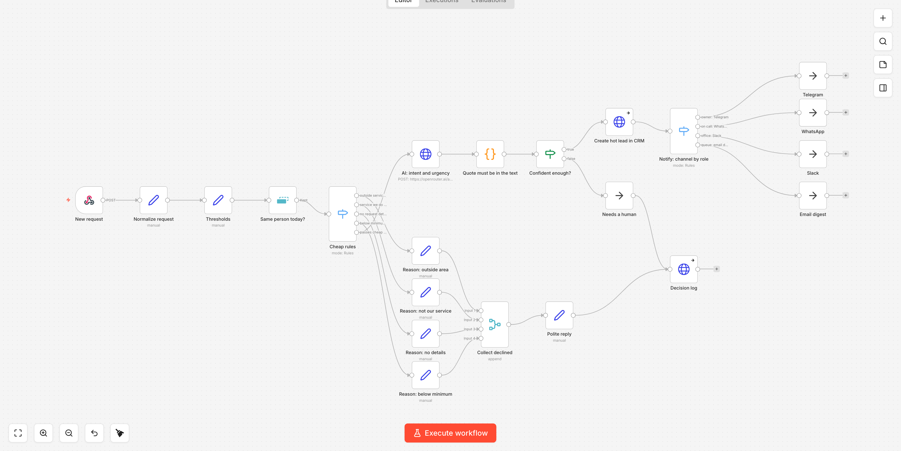
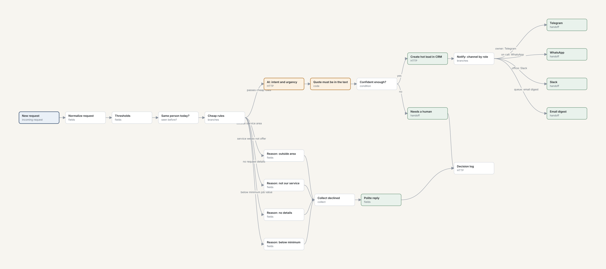

# Lead qualification demo

A service company gets forty inbound requests a day from a website form, WhatsApp
and Instagram. Half of them are noise, but a three-thousand-dollar job hides in that
half, so nobody can simply ignore the pile.

This demo screens that pile the way it should be screened: **cheap rules first, the
model only on what survives, and a quote from the request behind every decision.**

Live: https://demo-leads.om-dev.uk


## What it shows

<!-- demo-funnel -->
Five of forty requests reach a person. Twenty-nine are closed by a rule, and every
closed one carries the name of the rule that closed it plus the sentence from the
request that triggered it. That is the point of the whole thing: **a rule can be
argued with and adjusted, a model's opinion cannot.** Move a threshold on the page
and the next run uses it.
<!-- /demo-funnel -->

Requests are routed into five buckets: to the manager, a booking link, the nurture
list, a polite decline, and - kept separate - the disputed ones a person has to read.
A decision lands in "disputed" whenever the model is unsure **or its quote is not
found verbatim in the request text**. An explanation that cannot be traced back to
the source is decoration, not evidence.

## How it works

1. **Rules** run on every request, in order, for free: spam and advertising, no clear
   request, duplicate from the same person today, outside the service area, a service
   we do not offer, below the minimum order, an after-hours visit without the surcharge.
   The first rule that matches closes the request.
2. **The model** sees only survivors, and answers with an intent, an urgency, a
   confidence and a quote.
3. **The quote is verified** against the original text before anything is shown.

The page itself does not call the model: it replays a recorded run (`data/judgments.json`)
and computes the mechanical layer live. The recording date is printed on the page.

## The same thing as an n8n workflow

`workflow/lead-qualification.json` is an export of a workflow that actually runs, not a
drawing of one - twenty-two nodes, importable into any n8n instance. Every threshold is
a field in the editor rather than a line in a script, so the person who owns the business
can change the service area or the minimum job value without a developer.



The same workflow rendered from its export:



The diagram is generated from the export itself (`workflow/render_svg.py`), so it cannot
drift away from what the workflow does.

Inputs and outputs are meant to be swapped: a form webhook, WhatsApp Cloud API, Instagram,
or a CRM webhook on one side; GoHighLevel, Kommo, HubSpot, a calendar link or a notification
channel on the other. The core stays the same.

## Running it

```bash
./app.py              # http://127.0.0.1:8080
./app.py --selftest   # rules and assembly, no model calls
./app.py --record     # re-record the model run (rarely; never from the page)
```

Python 3.11+ and [uv](https://docs.astral.sh/uv/). Dependencies are declared in the script
header, so there is nothing to install by hand.

## About the data

The company (Bayline Comfort Co.) and every request in `data/requests.json` are invented.
No real person, address, phone number or email appears anywhere in this repository.

## Licence

MIT - see [LICENSE](LICENSE).
